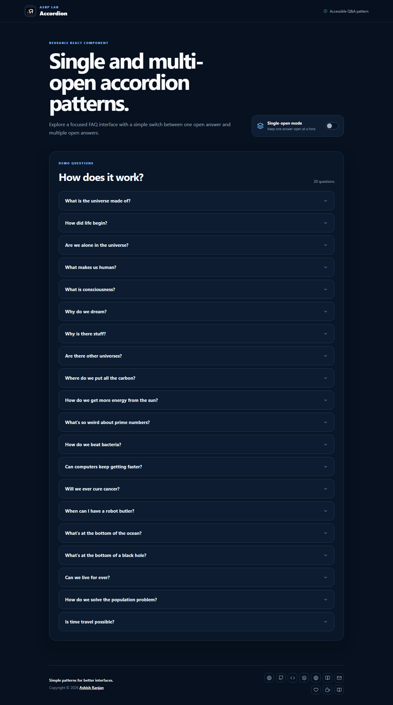

# Single and Multi Accordion

A responsive React accordion demo that shows the same question list in single-open or multi-open mode. It is designed as a small, reusable UI pattern for FAQs, documentation, and knowledge bases.



## Features

- Single-open mode for focused reading
- Multi-open mode for comparing answers
- Accessible buttons with expanded state and keyboard focus styles
- Responsive layout with fixed branded header
- Local question data and a floating go-to-top control

## Tech stack

- React and Create React App
- SCSS modules
- React Icons

## Run locally

```bash
npm install
npm start
```

## Deployment

Live app: [https://a2rp.github.io/single-multi-accordion/](https://a2rp.github.io/single-multi-accordion/)

## Links

- Portfolio: [https://www.ashishranjan.net/](https://www.ashishranjan.net/)
- GitHub: [https://github.com/a2rp](https://github.com/a2rp)
- CodePen: [https://codepen.io/ash1198](https://codepen.io/ash1198)
- LinkedIn: [https://www.linkedin.com/in/aashishranjan](https://www.linkedin.com/in/aashishranjan)
- Facebook: [https://www.facebook.com/theash.ashish/](https://www.facebook.com/theash.ashish/)
- YouTube: [https://www.youtube.com/@ashishranjan-ashz?sub_confirmation=1](https://www.youtube.com/@ashishranjan-ashz?sub_confirmation=1)
- Email: [ash.ranjan09@gmail.com](mailto:ash.ranjan09@gmail.com)

## Support

- Support: [https://a2rp-donation-page.netlify.app/](https://a2rp-donation-page.netlify.app/)
- Buy Me a Coffee: [https://buymeacoffee.com/a2rp](https://buymeacoffee.com/a2rp)
- Patreon: [https://patreon.com/a2rp](https://patreon.com/a2rp)